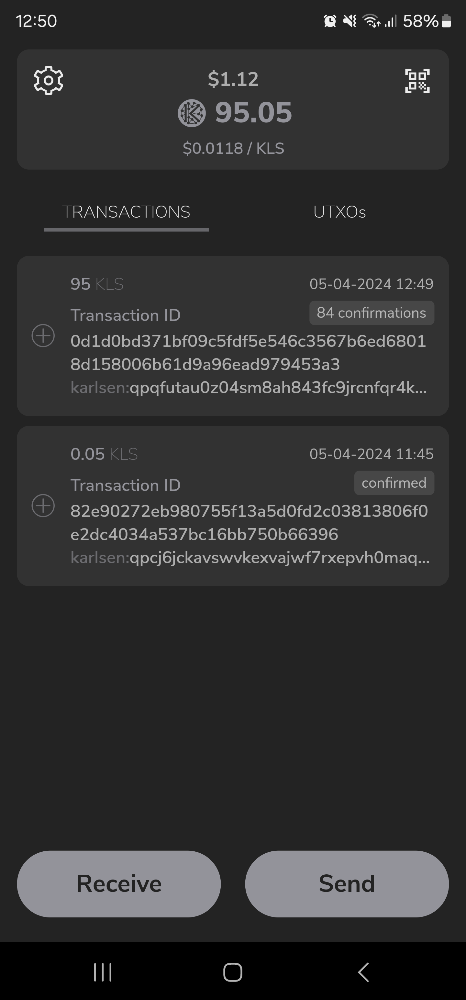
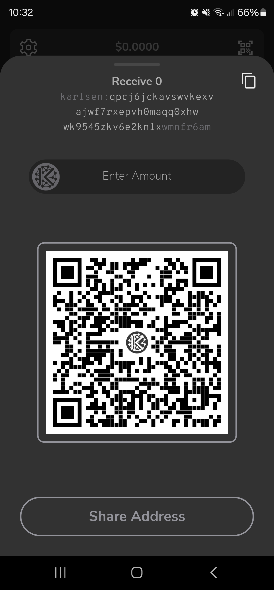
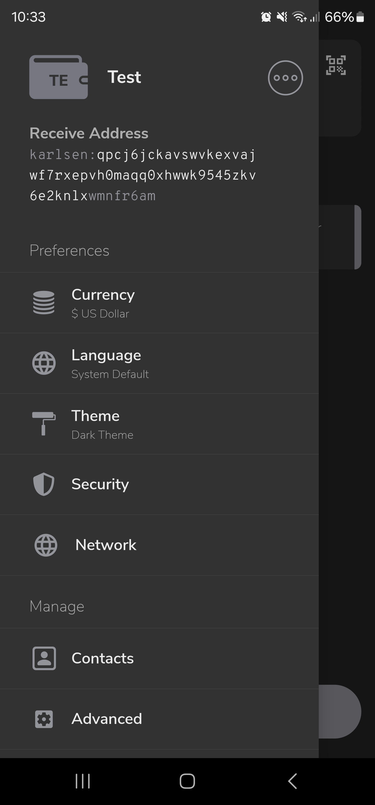
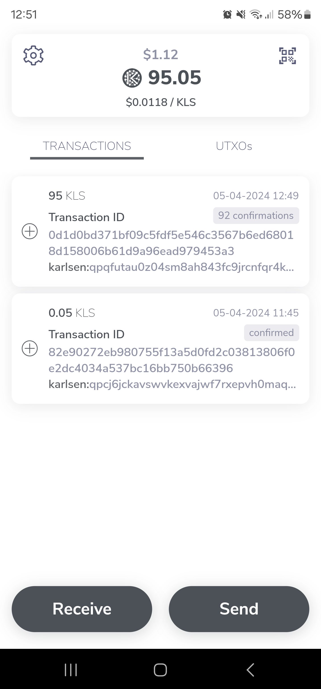
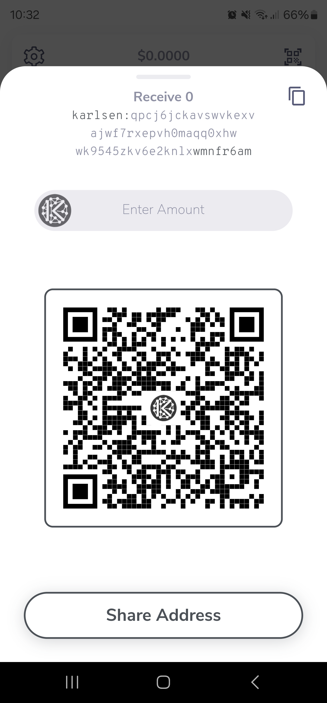
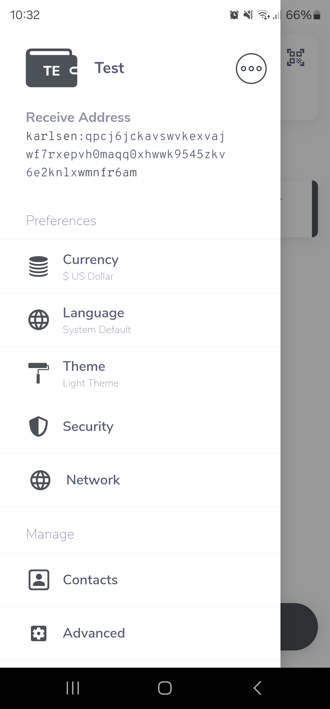

# Karlsen Mobile

Karlsen Mobile is a non-custodial wallet for the [Karlsen](https://www.karlsencoin.org/)
BlockDAG, available for Android and iOS. It is written in
[Dart](https://dart.dev) using [Flutter](https://flutter.dev).

| Link                                            | Description              |
| :---------------------------------------------- | :----------------------- |
| [karlsencoin.org](https://www.karlsencoin.org/) | Karlsen Network Homepage |

## Contributing

- Fork the repository and clone it to your local machine.
- Follow the instructions [here](https://flutter.io/docs/get-started/install)
  to install the Flutter SDK
- Setup [Android Studio](https://flutter.io/docs/development/tools/android-studio)
  or [Visual Studio Code](https://flutter.io/docs/development/tools/vs-code)

## Building

Android:

```bash
flutter build apk
```

To generate split APKs for different target architectures:
```bash
flutter build apk --split-per-abi
```

iOS:

```bash
flutter build ios
```

If you have a connected device or emulator you can run the app
right from your development machine.

Debug mode:

```bash
flutter run
```

Release mode:

```bash
flutter run --release
```

## Recompile gRPC Code

If you need to recompile the updated protocol code, please do the
following:

```bash
dart pub global activate protoc_plugin 20.0.1
protoc --dart_out="grpc:lib/karlsen/grpc" -I./proto messages.proto p2p.proto rpc.proto --plugin ~/.pub-cache/bin/protoc-gen-dart
```

## Regenerate Freezed Code

If you need to regenerate the runtime code, please do the following:

```bash
dart run build_runner build --delete-conflicting-outputs
```

## Translations

For some details regarding translations, have a look at
[translations and translators](./TRANSLATORS.md).

## Need Assistance?

If you have any questions or need help, don't hesitate to [submit a feature request or report an issue](https://github.com/karlsen-network/karlsen-mobile/issues/new/choose). If you can't find a solution, we're here to assist you.

You’re also welcome to join our Discord server for additional support and community interaction.

[](https://discord.gg/QyrvshRBJV)

## Screenshots

|  |  |  |
| -------------------------------- | -------------------------------- | -------------------------------- |
|  |  |  |
